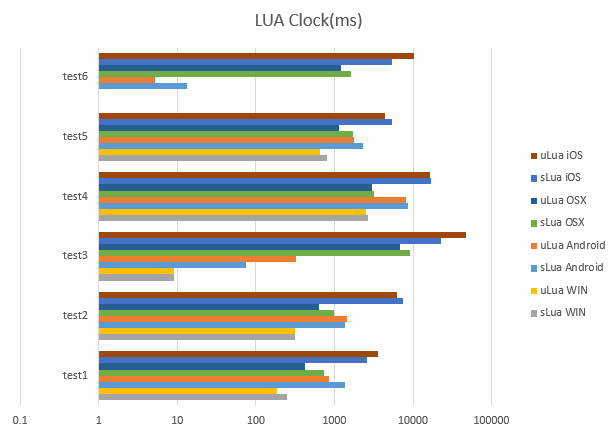
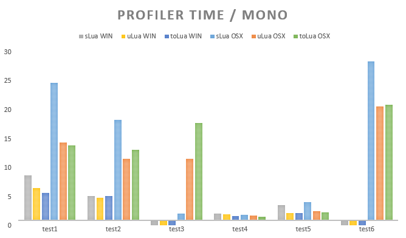
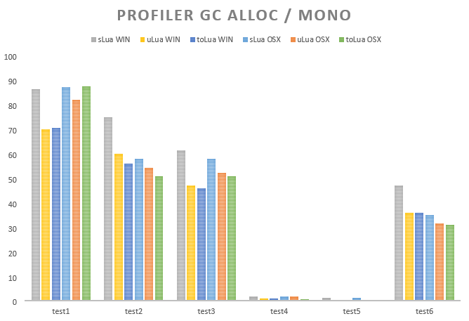

A simple test for performance comparsion between Lua in Unity。

**ATTENTION**: I'm a newbie to lua in fact, and this is only a simple test! If there is something wrong with my test or exists a better implemention, please contact me and I'll update ASAP! Any pull requests are welcomed!

一个针对Unity中执行Lua的简单性能测试。

**注意**: 本人对Lua是新手阶段，而且本项目旨在提供一个简单的测试比较。如果你发现我的测试代码有问题或者有更好的写法，请联系我、我会尽快改正。欢迎任何Pull Request！

TODO: Mesure startup consumption. sLua has a async init so I have to figure out a better way to Profiler.

Images below show test cases as vertical axis, and time or gc alloc in horizonal axis(**Log coordinate**).

下图纵坐标为测试用例，横坐标是消耗时间或内存分配(**对数坐标**)。

More details can be found in [benchmark.xlsx](benchmark.xlsx).

更多数据见[benchmark.xlsx](benchmark.xlsx)。

## Benchmark Methods 测试方法

Based on sLua's performance_test, I modified C# part to take advantage of **Profiler**, and ported into other Projects.

基于sLua自带的performance_test场景，我主要是修改了C#部分，利用**Profiler**来监控信息，并移植到其他项目中。

    Profiler.BeginSample("test1");
    l.luaState.getFunction("test1").call();
    Profiler.EndSample();

At the same time Lua part has a clock inside. These two mesured time may not be the same.

同时Lua代码部分也有一个计时器。这两个测出来的时间有可能不那么一致。

## Benchmark Environment 测试环境

- Windows(Editor)
	- Intel i5-3470 @ 3.20GHz, 16G RAM, NVIDIA GeForce GTX 660
	- Windows 10 64bit, Unity 5.2.4f1
- OSX(Editor)
	- Intel i7-3615QM @ 2.30GHz, 8G RAM, NVIDIA GeForce GT 650M
	- OSX 10.11.3, Unity 5.2.4f1
- Android(Release)
	- Nexus 6
	- Android 6.0.1
- iOS(Release, IL2CPP)
	- iPad 3
	- iOS 9.2.1

All tests are executed in sequence, only once.

所有测试顺序执行，且只执行一次。

## Changelog

[uLua](https://github.com/jarjin/uLua), [commit #dbe98bc](https://github.com/jarjin/uLua/commit/dbe98bce0a3fd169935617dec9e9fe129de8832b)

[sLua](https://github.com/pangweiwei/slua/commits/master), [commit #5388a6b](https://github.com/pangweiwei/slua/commit/5388a6b5acd4b7d09704806a770267ec00d6773d)

[toLua](https://github.com/topameng/tolua),  [commit #2ac8c9e](https://github.com/topameng/tolua/commit/2ac8c9e82bddbd22f681660b16ba316c78cf861f)

### 1.01 (20160221)

- toLua added

### 1.0 (20160221)

- some modification for Unity 5 API change
- port sLua benchmark to uLua
- use Profiler