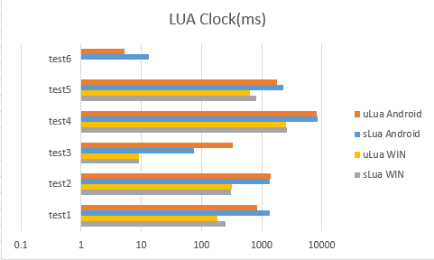
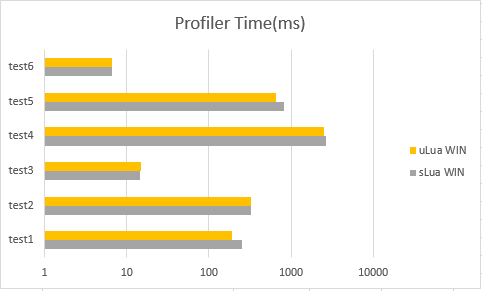
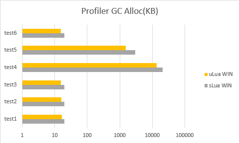
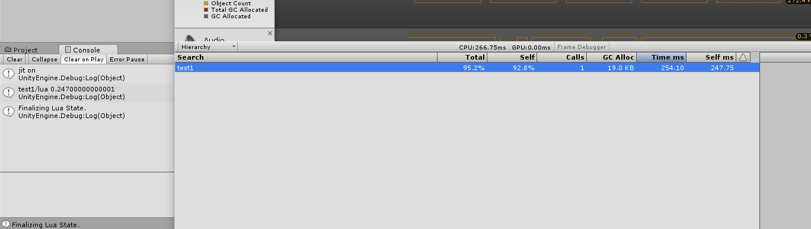

A simple test for performance comparsion between sLua & uLua.

**ATTENTION**: I'm a newbie to lua in fact, and this is only a simple test! If there is something wrong with my test or exists a better implemention, please contact me and I'll update ASAP! Any pull requests are welcomed!

TODO: Mesure startup consumption. sLua has a async init so I have to figure out a better way, with comparsion with uLua.

## Results

Detail data will be provided later.

## Benchmark Methods

Based on sLua's performance_test, I modified C# part to take advantage of **Profiler**, and copied into uLua Project.

>	Profiler.BeginSample("test1");
>	l.luaState.getFunction("test1").call();
>	Profiler.EndSample();

Also lua part has a clock inside.

## Benchmark Environment

- Windows(Editor)
	- Intel i5-3470 @ 3.2G, 16G RAM, NVIDIA GeForce GTX 660
	- Windows 10 64bit, Unity 5.2.4f1
- Android(Release, C# JIT)
	- Nexus 6
	- Android 6.0.1

All tests are executed in sequence, only once.

## Changelog

Current Status:

[uLua](https://github.com/jarjin/uLua)-master, [commit #dbe98bc](https://github.com/jarjin/uLua/commit/dbe98bce0a3fd169935617dec9e9fe129de8832b)

[sLua](https://github.com/pangweiwei/slua/commits/master)-master, [commit #5388a6b](https://github.com/pangweiwei/slua/commit/5388a6b5acd4b7d09704806a770267ec00d6773d)

### 1.0 (20160221)

- some modification for Unity 5 API change
- port sLua benchmark to uLua
- use Profiler