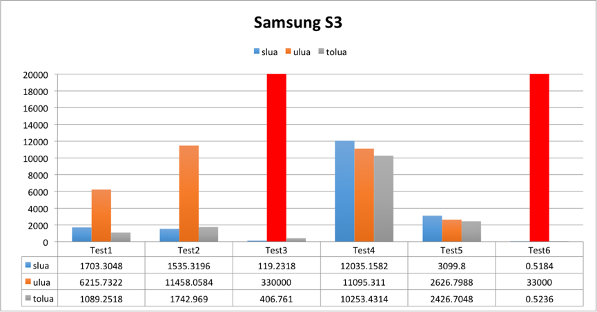
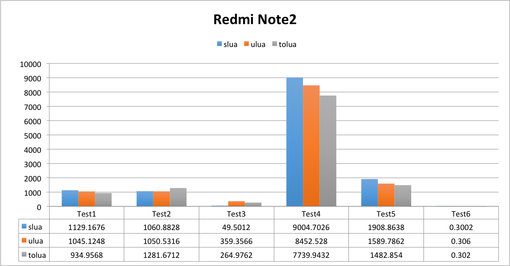
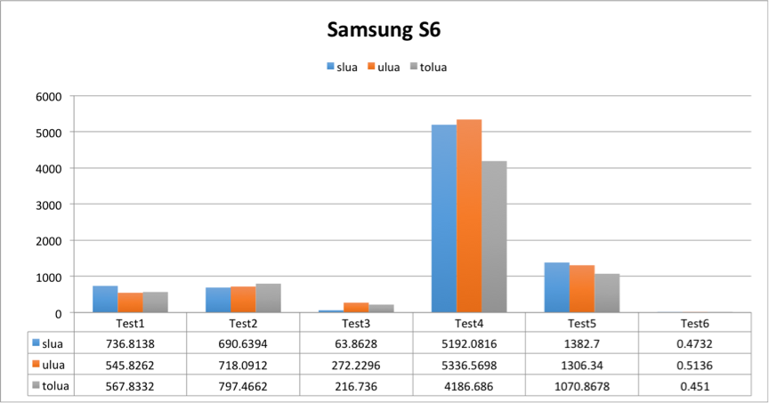
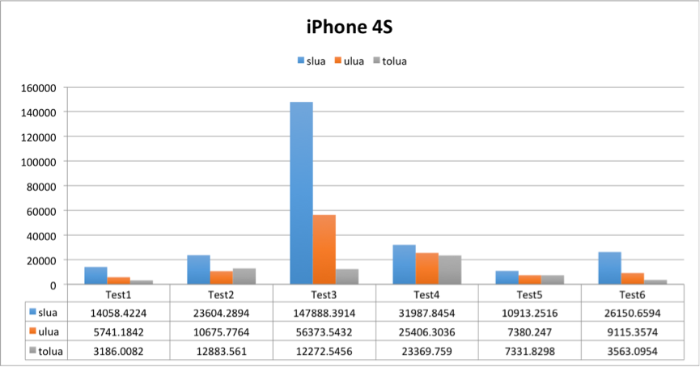
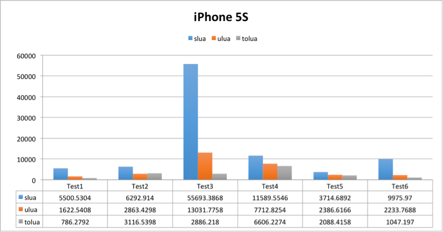

A simple test for performance comparsion between Lua in Unity。

一个针对Unity中执行Lua的简单性能测试。

## Benchmark Content 测试内容

Based on sLua's performance_test, I ported these into other Projects.

基于sLua自带的performance_test场景，我将其移植到其他项目中。

## Benchmark Results 测试结果

Every test is executed five times, and then reboot App. Thanks for [UWA](https://www.uwa4d.com/) provided the newest test results with different devices. The original post can be found in `侑虎科技` Blog [Unity项目常见Lua解决方案性能比较](http://blog.uwa4d.com/archives/lua_perf.html).

每个测试顺序执行五次，然后重启。这里感谢[侑虎科技UWA](https://www.uwa4d.com/)进行了最新版本在不同移动设备上的测试，原报告来自`侑虎科技`博客 [Unity项目常见Lua解决方案性能比较](http://blog.uwa4d.com/archives/lua_perf.html)。

### Android

以下为UWA在 Android上对高、中、低配置的三款设备进行测试后得到的平均数据，图中下方的表格部分为柱状图的准确数值，而其数值表示的是完成测试用例所需的时间，单位为毫秒。

- 低端设备：三星 S3 (Android OS 4.3)

- 中端设备：红米 Note2 (Android OS 5.0.2)

- 高端设备：三星S6 (Android OS 6.0.1)

### iOS

以下为UWA在 iOS上对armv7和arm64的两款设备进行测试后得到的平均数据，测试中使用了il2cpp＋Universal的发布方式，同时禁用了bitcode。图中下方的表格部分为柱状图的准确数值，而其数值表示的是完成测试用例所需的时间，单位为毫秒。

- armv7设备：iPhone 4s (OS 7.1.2)

- arm64设备：iPhone 5s (OS 9.3.5)

## Changelog

### Current Code Base

- [uLua](https://github.com/jarjin/uLua), [commit #dbe98bc](https://github.com/jarjin/uLua/commit/dbe98bce0a3fd169935617dec9e9fe129de8832b)
- [sLua](https://github.com/pangweiwei/slua), [commit #ef57252](https://github.com/pangweiwei/slua/commit/ef572524e5b95ff5305bd33d0f7a2725716f6ae5)
- [toLua](https://github.com/topameng/tolua),  [commit #710dedc](https://github.com/topameng/tolua/commit/710dedccb151cd7066fd1f6ec27902867c8f09fc)

### 1.04 (20160928)

- new data from UWA

### 1.03 (20160814)

- new data with new test methods (five times execution, which providing more details)

### 1.02 (20160403)

- upgrade to Unity 5.3.4
- mono version added
- new normalized graph

### 1.01 (20160221)

- toLua added

### 1.0 (20160221)

- some modification for Unity 5 API change
- port sLua benchmark to uLua
- use Profiler
